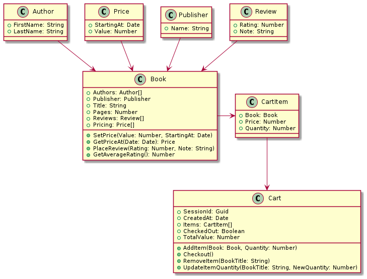

# Hello Mutation Tests

Explore unit testing and mutations for .Net Core & JavaScript/Typescript libs.

## About the case

There's a part of a hypothetical Bookstore that controls simple functionalities about recording books and it's authors, setting prices and placing ratings.
 
It's implemented both in TypeScript *(in `javascript` folder)* and C# *(in `dotnet` folder)* to explore diferences and insights about Unit Testing Code Coverage and Test Mutation Score.

## Running tests for .Net

In `src/dotnet` folder:
- To run **Unit Tests**, execute the following command: `./scripts/test.cmd`
- To run **Mutation Tests**, execute the following command: `./scripts/mutate.cmd`

## Running tests for JavaScript/TypeScript